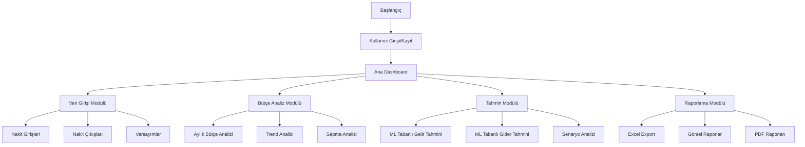

# Kişisel Nakit Bütçe Yönetim Sistemi

## Akış Şeması

## Sistem Bileşenleri

1. **Veri Girişi Modülü**
   - Gelir kategorileri (Aile desteği, burs, part-time gelir vb.)
   - Gider kategorileri (Yurt/kira, eğlence, eğitim vb.)
   - Ekonomik varsayımlar (Enflasyon, faiz oranları vb.)

2. **Bütçe Analiz Modülü**
   - Aylık nakit akış analizi
   - Kategori bazlı harcama analizi
   - Bütçe-gerçekleşme karşılaştırması

3. **Tahmin Modülü (ML/AI)**
   - Geçmiş verilere dayalı gelir tahmini
   - Harcama pattern analizi
   - Anomali tespiti
   - Ekonomik göstergelere dayalı projeksiyon

4. **Raporlama Modülü**
   - İnteraktif dashboard
   - Excel export özelliği
   - Detaylı PDF raporları
   - Görsel grafikler ve analizler

## Teknoloji Stack

- **Frontend:** Streamlit
- **Backend:** Python
- **ML/AI:** Scikit-learn, Prophet
- **Veri İşleme:** Pandas, NumPy
- **Görselleştirme:** Plotly, Altair
- **Export:** OpenPyXL, ReportLab

## Özellikler

- Kullanıcı dostu arayüz
- Otomatik veri doğrulama
- Gerçek zamanlı hesaplamalar
- ML tabanlı tahminleme
- Özelleştirilebilir raporlar
- Excel ve PDF export
- Veri görselleştirme
- Senaryo analizi
# maliyetAnalizi
